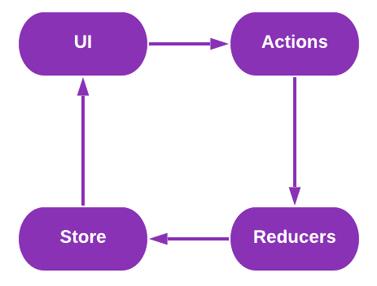
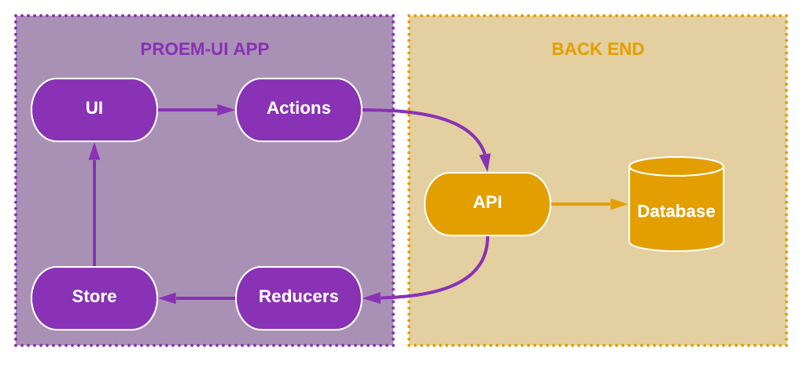

## Core Principle

The flow of information in a ReactJS app, should go in a single direction:

Here, the UI invokes an action, which in turn triggers a reducer, which updates a data store, which updates the UI. 

At first this may seem like a lot work to simply make changes to data. However, making the data in your app always flow in a
single direction like this will make debugging your app far easier, and will vastly improve its scalability. 

Of course, most apps will have at least one backend system they will interact with. If we look at the same flow, with an API 
introduced, it illustrates how clean and powerful this flow becomes:


&gt; Suggestion: If you are new ro React and Redux, we suggest first watching [LearnCode.academy](https://twitter.com/learncodeacad)'s 
&gt; tutorial series in [React JS](https://youtu.be/MhkGQAoc7bc?list=PLoYCgNOIyGABj2GQSlDRjgvXtqfDxKm5b) and [Redux](https://youtu.be/1w-oQ-i1XB8?list=PLoYCgNOIyGABj2GQSlDRjgvXtqfDxKm5b).

## Each Flow Step

### Store -&gt; UI

First we need to look at the app’s data store and how it works, then we can look at how that data store is fed to the UI.

#### Data Store

By leveraging [Redux](https://redux.js.org/) your Proem-UI will have a single central data store. This store is created 
within the `/store.js` right on the root of your project. 

If you take a look at `/store.js`, you will see it imports the reducers for setting the store’s initial state as well 
as manipulating it. We will see more on that below in the “reducer -&gt; store” section. 

&gt; Note: The `/store.js` comes preconfigured with `redux-logger`, which will only be used in debug/developer mode. This 
&gt; will automatically output any changes to your data store to the browser console. This makes debugging your app far
&gt; easier. 

#### Connecting Store to UI

The store is bright into your app via the `rendered.js`, which passes the store into the `<Provider>` component, which is wrapped around your app and makes the store accessible to all the app’s components.

This will give any component access to the store by using the `connect` function of `react-redux`. Here is an example:

```javascript

import React, { Component } from 'react';
import { connect } from 'react-redux';

import { MyDomainArray } from '../../domain';

const propMap = store => ({
    list: store.items.list,
    fetching: store.items.fetching,
    fetched: store.items.fetched,
});

class MyPage extends Component {
    static propTypes = {
        list: PropTypes.instanceOf(MyDomainArray).isRequired,
        fetching: PropTypes.bool.isRequired,
        fetched: PropTypes.bool.isRequired,
    };

    static defaultProps = {};

    render() {
        const {
            list, fetched, fetching,
        } = this.props;

        if (!fetched || fetching) return (<div>Loading...</div>);

        return (
            <ul>
                {list.map(item => (
                    <li key="item.id">{item.text}</li>
                ))}
            </ul>
        );
    }
}

export default connect(propMap)(MyPage);


```

This example creates a page component called MyPage, and connects the data store to it, mapping specific data store 
fields using `propsMap`. The store mapping maps 3 fields from a store called items: `fetching`, `fetched`, and `list`. 
The `list` is a `MyDomainArray`, we will see more on domain objects below. It simply loops the list and outputs each 
item in it. 

&gt; Suggestion: For keeping your connections clear and clean, we suggest that for most apps only connect your pages 
&gt; (components in `/pages`) directly to the store. All data passed into components (components in `/components`) be done 
&gt; as properties. This can help keep the data flow clear and avoid complicated debugging scenarios. It also makes your 
&gt; components more decoupled and less dependent on the specifics of the data store. 

#### Further Reading

-   Learn more about [Redux Stores](https://redux.js.org/basics/store)

### UI -&gt; Actions

Actions are a collection of functions that can be called to change the state of the application, or otherwise perform external activities. For example, calling an API method. 

All actions are in `/actions` and are aggregated and made conveniently accessible via the `actions/index.js`. In Redux 
all action methods need to be "bound", which Proem-UI makes easy with the `actionProvider` method, which we cover below.

#### Creating Actions

First, let’s look at how to make a new action function. We will make a function that will be used to update the title of the application. 

In file `appStateActions.js`:

```javascript

import { asPromise } from './utils';

export function setTitle(title) {
    return {
        type: 'SET_TITLE',
        payload: asPromise(title),
    };
}

```

This creates a function called `setTitle`. All actions need to return an object that contains a `type` and `payload` (and can optionally include other things, for example you may include a `meta` property). The `asPromise` function is a convenience function provided by Proem-UI to make it easier to turn plan payloads into promises so that actions can be synchronized if needed. 

To make accessing all your actions easier, make sure to add `actions/appStateActions.js` to `actions/index.js`. The index is already created for you, simply add your actions to the `actionsToBind` object:

```javascript

...
import * as AppStateActions from './appStateActions';
...
const actionsToBind = {
    AppStateActions,
};
...

```

#### API Actions

Most apps will need to fire actions that invoke a API call. This is easily done in Proem-UI using [Axios](https://github.com/axios/axios). 

Example `action/itemActions.js`:

```javascript

import axios from 'axios';
import Config from 'Config';

import { generateHeader } from './utils';

const baseUrl = `${Config.apiUrl}/items`;
const baseName = 'ITEMS';

export function add(item) {
    const headers = generateHeader();
    return {
        type: `${baseName}_ADD`,
        meta: item,
        payload: axios.post(baseUrl, item.toJSON(), { headers }),
    };
}

export function update(item) {
    const headers = generateHeader();
    return {
        type: `${baseName}_UPDATE`,
        meta: item,
        payload: axios.put(`${baseUrl}/${item.id}`, item.toJSON(), { headers }),
    };
}

export function get(id) {
    const headers = generateHeader();
    return {
        type: `${baseName}_GET`,
        meta: id,
        payload: axios.get(`${baseUrl}/${id}`, { headers }),
    };
}

export function list() {
    const headers = generateHeader();
    return {
        type: `${baseName}_LIST`,
        payload: axios.get(baseUrl, { headers }),
    };
}

export function remove(item) {
    const headers = generateHeader();
    return {
        type: `${baseName}_REMOVE`,
        meta: item,
        payload: axios.delete(`${baseUrl}/${item.id}`, { headers }),
    };
}


```

In this we use `generateHeader` as another convenience method. Place your API’s expected HTTP headers in this function. Proem-UI comes with an example, based on Parse Platform. 

As before, make sure to add your new actions file to `actions/index.js`:

```javascript

...
import * as AppStateActions from './appStateActions';
import * as ItemActions from './itemActions';
...
const actionsToBind = {
   AppStateActions,
   ItemActions,
};
...

```

#### Connecting Actions to UI

```javascript

import React, { Component } from 'react';
import { connect } from 'react-redux';

import Actions, { actionProvider } from 'actions';

import { MyDomainArray } from '../../domain';

const propMap = store => ({
    list: store.items.list,
    fetching: store.items.fetching,
    fetched: store.items.fetched,
});

class MyPage extends Component {
    static propTypes = {
        list: PropTypes.instanceOf(MyDomainArray).isRequired,
        fetching: PropTypes.bool.isRequired,
        fetched: PropTypes.bool.isRequired,
        actions: PropTypes.instanceOf(Actions).isRequired,
    };

    static defaultProps = {};

    componentDidMount() {
        const { actions: { AppStateActions } } = this.props;
        AppStateActions.setTitle('Example Page');
    }

    render() {
        const {
            list, fetched, fetching,
        } = this.props;

        if (!fetched || fetching) return <div>Loading...</div>;

        return (
            <ul>
                {list.map(item => (
                    <li key="item.id">{item.text}</li>
                ))}
            </ul>
        );
    }
}

export default connect(propMap, actionProvider)(MyPage);


```

The `actionProvider` is the Proem-UI provided function used to easily load in and bind your applications action objects 
for you.  

&gt; Suggestion: Much like connecting data stores, we suggest that only page components (components in `/pages`) connect 
&gt; directly to actions using the `actionProvider` and that the actions object is then passed into components (components 
&gt; in `/components`).

#### Further Reading

-   Learn more about [Redux Actions](https://redux.js.org/basics/actions)
-   Learn more about [Axios](https://github.com/axios/axios)

### Actions -&gt; Reducers -&gt; Store

We’ve now covered how a UI can connect and display information from the application’s data stores, and how to invoke an action. Now we can look at how we capture those actions being requested to react to them. This is done with reducers

All reducers are stored in `reducer` and are joined together for easy export in `reducer/index.js`. Proem-UI comes configured so that once you have included your reducer to `reducer/index.js` it will then be automatically included as a part of your application’s store.

Continuing with our previous examples for setting an application title, here is `reducer/appStateReducer.js`:

```javascript

const initState = {
    title: 'Initial Title',
};

export default function reducer(state = initState, action) {
    switch (action.type) {
        case 'SET_TITLE': {
            return { ...state, title: action.payload };
        }

        default: {
            return state;
        }
    }
}

```

This initializes the title as 'Initial Title' and then updates it whenever it sees the 'SET_TITLE' action type.

To continue our previous examples of displaying a list of items, this would be the `reducer/itemReducer.js`:

```javascript

import Config from 'Config';
import { MyDomainArray, MyDomainObject } from '../domain';

const baseName = 'ITEMS';

const initState = {
    list: new MyDomainArray(),
    fetching: false,
    fetched: false,
};

export default function reducer(state = initState, action) {
    switch (action.type) {

        case `${baseName}_LIST_PENDING`: {
            return { ...state, fetching: true };
        }

        case `${baseName}_LIST_FULFILLED`: {
            const list = new MyDomainArray(action.payload.data.results);
            return {
                ...state, list, fetching: false, fetched: true,
            };
        }

        case `${baseName}_UPDATE_FULFILLED`: {
            const list = state.list.clone();
            const obj = new MyDomainObject(action.payload.data);
            list.update(obj);
            return { ...state, list };
        }

        case `${baseName}_ADD_FULFILLED`: {
            const list = state.list.clone();
            const obj = new MyDomainObject(action.payload.data);
            list.add(obj);
            return { ...state, list };
        }

        case `${baseName}_REMOVE_FULFILLED`: {
            const list = state.list.clone();
            list.remove(new MyDomainObject({ id: action.meta.id }));
            return { ...state, list };
        }

        default: {
            return state;
        }
    }
}


```

You may have noticed that even though the actions fire events with types `ITEMS_ADD`, `ITEMS_LIST`, etc, the reducer
is watching for  `ITEMS_ADD_FULFILLED`, `ITEMS_LIST_FULFILLED`. This is a special addition made for actions that have a 
promise for a payload, like Axios calls to API methods. Actions with promises as paylaods will have 3 possible types fires:

-   `*_PENDING` - Fired when the action first starts
-   `*_FULFILLED` - Fired when the action completes successfully
-   `*_REJECTED` - Fire if thew action results in an error

For more information see [redux-promise-middleware](https://github.com/pburtchaell/redux-promise-middleware/blob/HEAD/docs/introduction.md).

Both of these reducers need to be added to `reducer/index.js` to make then accessible in by the application:

```javascript

import { combineReducers } from 'redux';

import appState from './appStateReducer';
import item from './itemReducer';

export default combineReducers({
    appState,
    item,
});


```

#### Further Reading

-   Learn more about [Redux Reducers](https://redux.js.org/basics/reducers)
-   Learn more about [Redux Stores](https://redux.js.org/basics/store)
-   Learn more about [redux-promise-middleware](https://github.com/pburtchaell/redux-promise-middleware/blob/HEAD/docs/introduction.md)

## More Resources

If you are new to React, we suggest watching through these 14 videos on React & Flux by [LearnCode.academy](https://twitter.com/learncodeacad):

-   [React JS Tutorial](https://youtu.be/MhkGQAoc7bc?list=PLoYCgNOIyGABj2GQSlDRjgvXtqfDxKm5b)

After, we would also suggest take a look at these 7 videos on Redux within React, also by [LearnCode.academy](https://twitter.com/learncodeacad):

-   [Redux Tutorial](https://youtu.be/1w-oQ-i1XB8?list=PLoYCgNOIyGABj2GQSlDRjgvXtqfDxKm5b)
